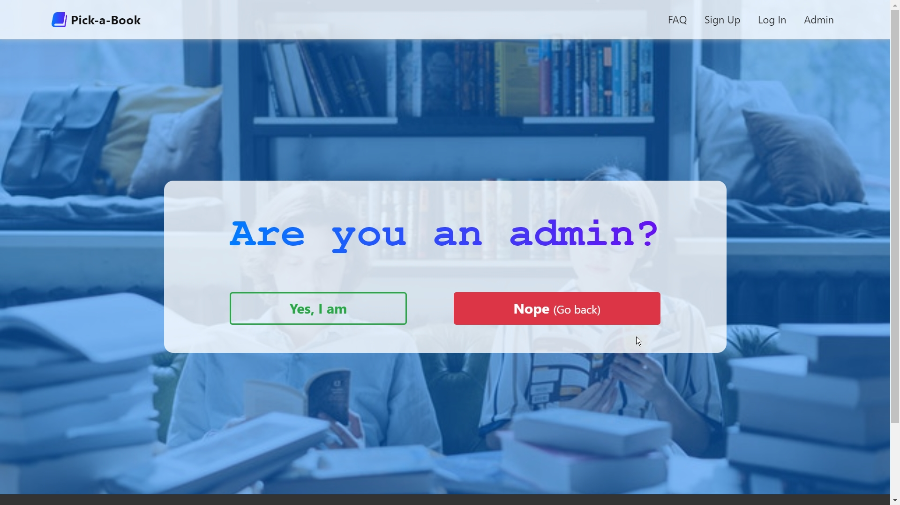

# Pick-a-Book 

A peer-to-peer buying, selling and exchanging platform for old used books.

### SAD Lab – CSE 3412 – Spring 2021 
#### System Analysis and Design Laboratory
 

> Student’s Name	: Ahmed Shabab Noor  
> Student’s ID		: 011 193 024  
> Project Name	    : Pick-a-Book  

Here users can post about their used books which they are interested in selling, renting or exchanging. This will enable others users to get their hands on their favorite books and book collections. Moreover, users passionate about books can write blogs about their favorite books and stories on this platform. There will also be a functionality which will allow the users to find nearby libraries in their area

 

#### About Page
# 

#### User Home Page
# 

#### User Login Page
# 

#### Available Books Page
# 

#### Library Search Page
# 

#### Library Details Page
# 

#### Admin Confirmation Page
# 