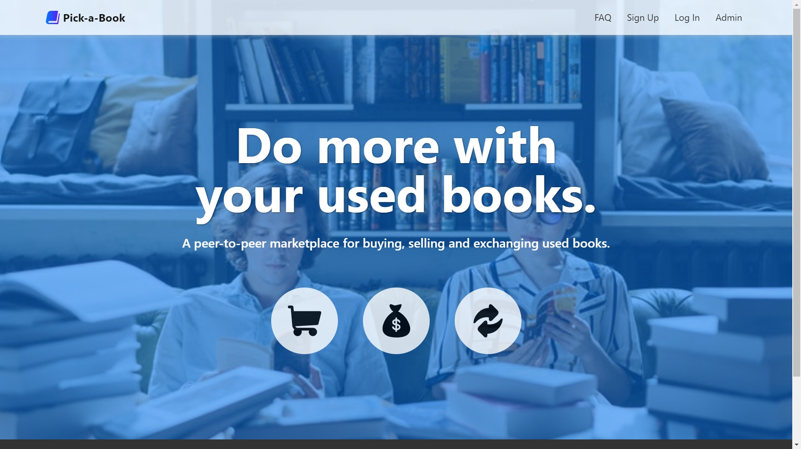
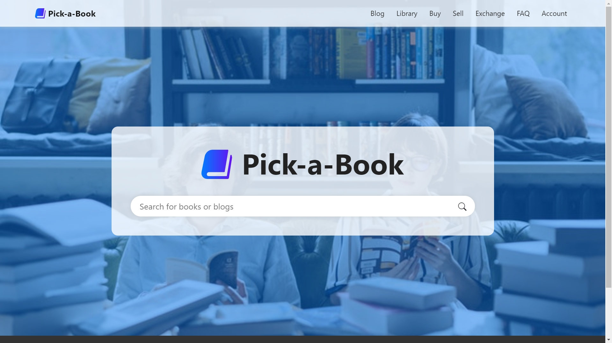
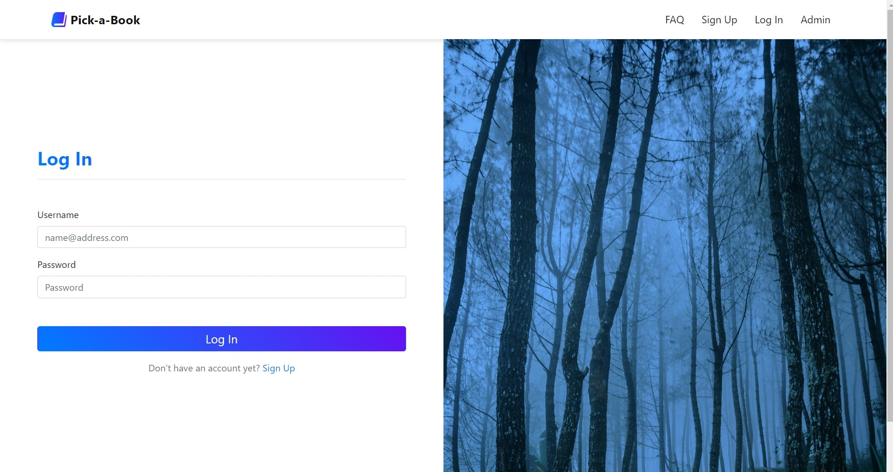
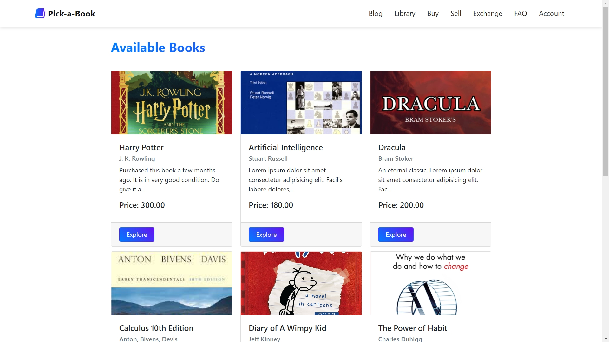
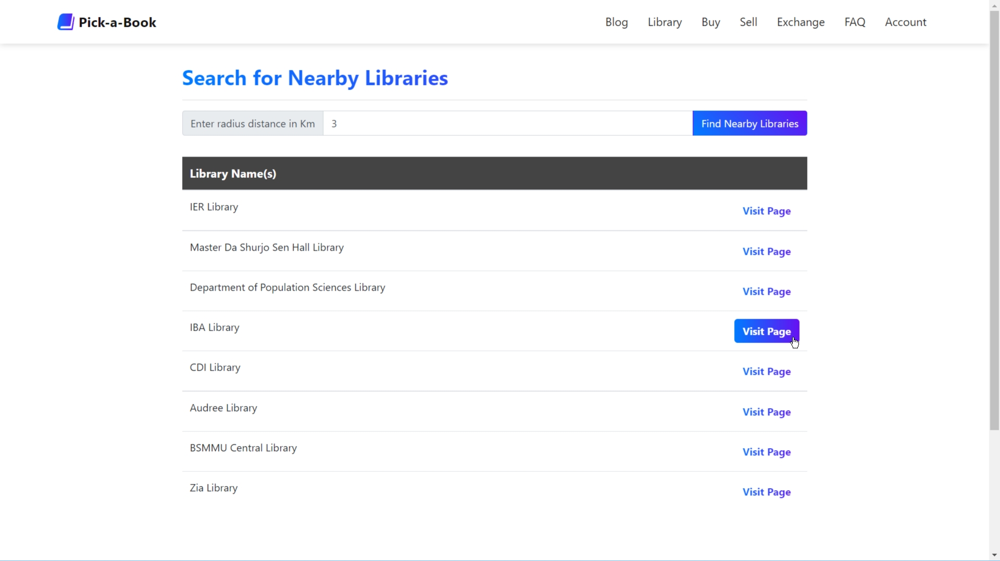
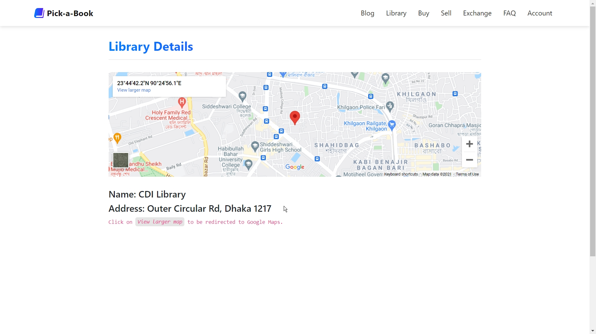

# Pick-a-Book 

A peer-to-peer buying, selling and exchanging platform for old used books.

### SAD Lab – CSE 3412 – Spring 2021 
#### System Analysis and Design Laboratory
 

> Student’s Name	: Ahmed Shabab Noor  
> Student’s ID		: 011 193 024  
> Project Name	    : Pick-a-Book  

 

#### About Page
# 

#### User Home Page
# 

#### User Login Page
# 

#### Available Books Page
# 

#### Library Search Page
# 

#### Library Details Page
# 